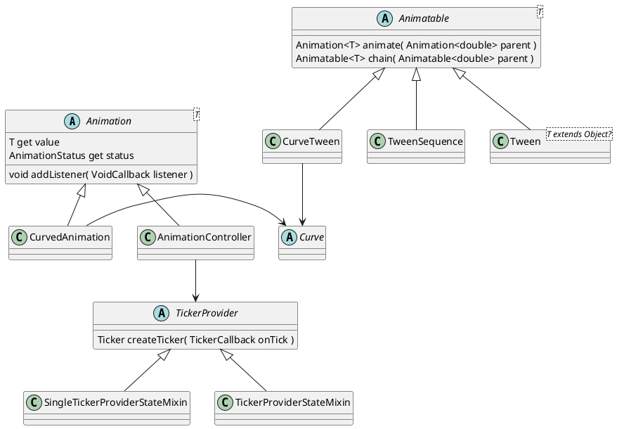

# Animation

## Ticker

All the animation is triggered by ticker. Flutter widget could get a ticker by `mixin` `SingleTickerProviderStateMixin` or `TickerProviderStateMixin`.

The animation will run in a duration. And the ticket will dirve the this duration.

## Value

The animation has a start value and end value. `AnimationController` will product a value with current `duration` which drived by the `ticker`. By default, the start value is 0, and end is `1.0`.

The value will be producted by `Animation`'s value, developer could add listener by `addListener`to monitor the value's change, meanwhile, also could monitor the animation's status.

## Tween

Since the `AnimationController` only prodct a `double` interploate value, so we need other class to product a value could be apply to the widget.

`Tween` will product differet types' value, like `int`, `color`, `decoration`...The `Tween` product a `interpolating` value which could generate an animation by `animate` method.

## Curve

Since the top class which mentioned just product a linear value, so we need `Curve` to create a `Curve` value.

Developer could use the `CurvedAnimation` to bind a `AnimationController` to generate `animation` which could listen value's change, or use `CurveTween` to bind a `Tween` to product a animatable value which will generate animation's by `animation` method.
