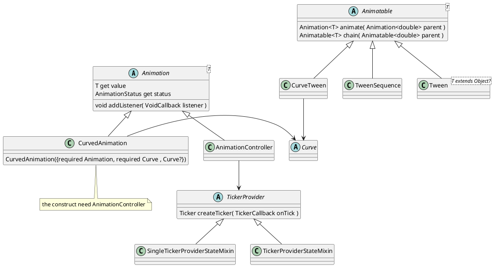

# Animation



```plantuml
@startuml

abstract Animation<T> {
    T get value
    AnimationStatus get status
    void addListener( VoidCallback listener )
}

class AnimationController
class CurvedAnimation{
    CurvedAnimation({required Animation, required Curve , Curve?})
}
note bottom: the construct need AnimationController

CurvedAnimation -up-|> Animation
AnimationController -up-|> Animation

abstract Animatable<T> {
    Animation<T> animate( Animation<double> parent )
    Animatable<T> chain( Animatable<double> parent )
}
class Tween<T extends Object?>
class CurveTween
class TweenSequence

Tween -up-|> Animatable
CurveTween -up-|> Animatable
TweenSequence -up-|> Animatable

abstract Curve

CurvedAnimation -right-> Curve
CurveTween -down-> Curve

abstract TickerProvider{
    Ticker createTicker( TickerCallback onTick )
}
class SingleTickerProviderStateMixin
class TickerProviderStateMixin

SingleTickerProviderStateMixin -up-|> TickerProvider
TickerProviderStateMixin -up-|> TickerProvider

AnimationController -down-> TickerProvider
@enduml
```

## Ticker

All the animation is triggered by ticker. Flutter widget could get a ticker by `mixin` `SingleTickerProviderStateMixin` or `TickerProviderStateMixin`.

The animation will run in a duration. And the ticket will dirve the this duration.

## Value

The animation has a start value and end value. `AnimationController` will product a value with current `duration` which drived by the `ticker`. By default, the start value is 0, and end is `1.0`.

The value will be producted by `Animation`'s value, developer could add listener by `addListener`to monitor the value's change, meanwhile, also could monitor the animation's status.

The animation use method `Animation<U> drive<U>( Animatable<U> child )` to `drive` the `Animatable`.

## Tween

which is a `Animatable` class for `Animation`.

Since the `AnimationController` only prodct a `double` interploate value, so we need other class to product a value could be apply to the widget.

`Tween` will product differet types' value, like `int`, `color`, `decoration`...The `Tween` product a `interpolating` value which could generate an animation by `animate` method.

class `CurveTween` use to `bind` a `Curve` for the chanin `Tween`.

### Tween Chain

Purpose

Simplifies the creation of complex animations by composing multiple Tween actions into a single, manageable unit.

```dart
final controlelr = AnimationController()
final tween = ColorTween().chain(CurveTween())
controlelr.drive(tween)
```

### [Tween sequence](https://medium.com/thismightwork/https-medium-com-thomas-cornet-sequenced-animations-in-flutter-7c4fa4117598)

Purpose

Allows you to control the timing and duration of each Tween step, creating more complex, multi-step animations. 

- [Advanced Flutter Animations – Staggered Animations, Tween Chaining and Transforms](https://flexiple.com/app/advanced-flutter-animations)

## Curve

Since the top class which mentioned just product a linear value, so we need `Curve` to create a `Curve` value.

Developer could use the `CurvedAnimation` to bind a `AnimationController` to generate `animation` which could listen value's change, or use `CurveTween` to bind a `Tween` to product a animatable value which will generate animation's by `animation` method.
