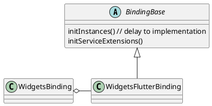
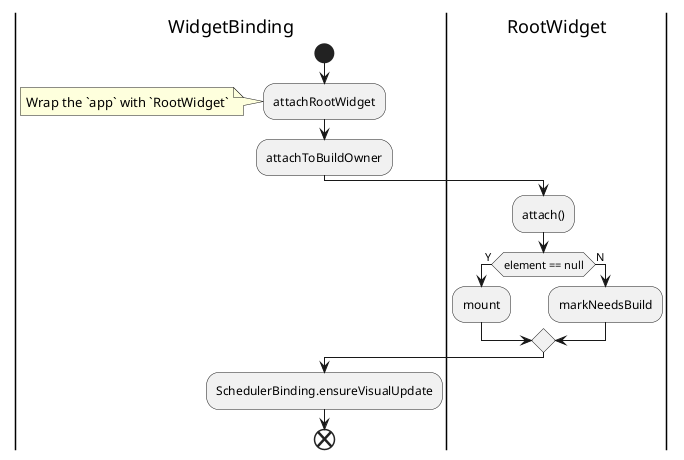
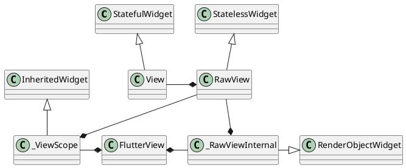
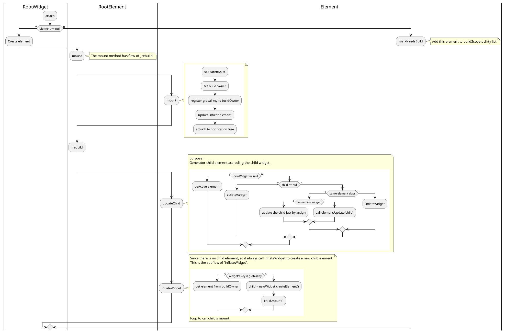

# Flutter App launch

All the code refence from flutter version 3.29.3, dart 3.7.2.

## RunApp

`[runApp] which bootstraps a widget tree and renders it into a default [FlutterView]`

```dart
void runApp(Widget app) {
  final WidgetsBinding binding = WidgetsFlutterBinding.ensureInitialized();
  _runWidget(binding.wrapWithDefaultView(app), binding, 'runApp');
}
```

### WidgetsFlutterBinding.ensureInitialized



The method `initInstances` will be called in class `WidgetsFlutterBinding` 's constructor. which will set the `WidgetsBinding`'s instance.

### _runWidget

Method `_runWidget` will build the element tree.

```dart
void _runWidget(Widget app, WidgetsBinding binding, String debugEntryPoint) {
  binding
    ..scheduleAttachRootWidget(app)
    ..scheduleWarmUpFrame();
}
```




### WidgetsFlutterBinding.wrapWithDefaultView

Generate the `View` widget which contain a `FlutterView` will be drawn. The `View` also includes 

```dart
Widget wrapWithDefaultView(Widget rootWidget) {
    return View(
      view: platformDispatcher.implicitView!,
      deprecatedDoNotUseWillBeRemovedWithoutNoticePipelineOwner: pipelineOwner,
      deprecatedDoNotUseWillBeRemovedWithoutNoticeRenderView: renderView,
      child: rootWidget,
    );
  }
```

The `View` 's purpose is building the render tree.



## Build child element tree

After attach to root widget, the build owner will start to `mount` child which will build a element tree.

This is the flow of mount belong to `RootElement`.



The render tree will aslo be built when element changed.

After that, it will ask to refresh to screen.