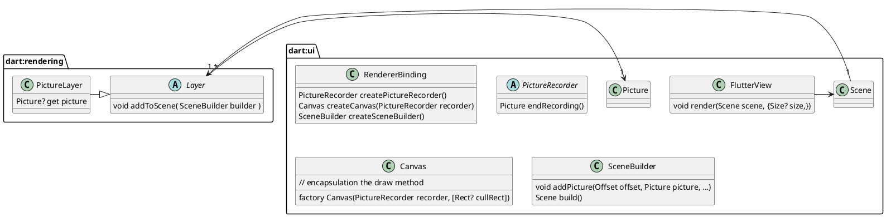

# Render flow


```txt
To composite the tree, create a ui.SceneBuilder object using RendererBinding.createSceneBuilder,<br> pass it to the root Layer object's addToScene method, and then call ui.SceneBuilder.build to obtain a ui.Scene.<br> A ui.Scene can then be painted using ui.FlutterView.render.
```

