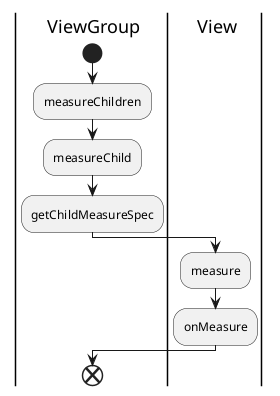
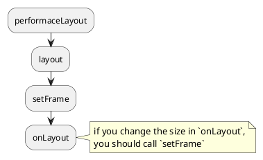
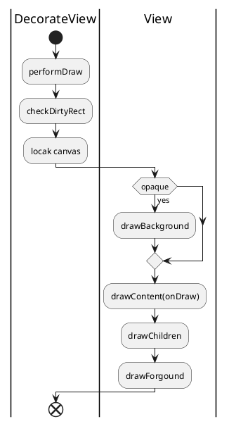
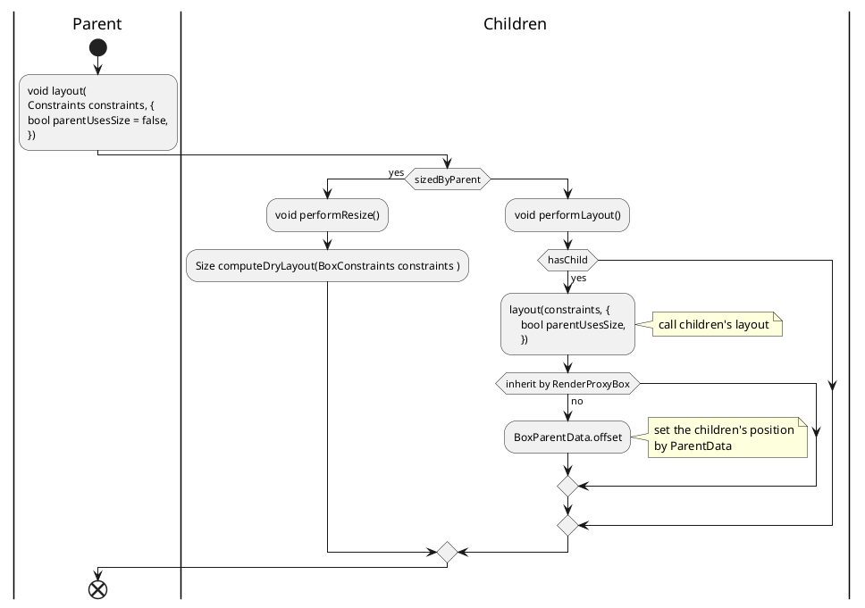
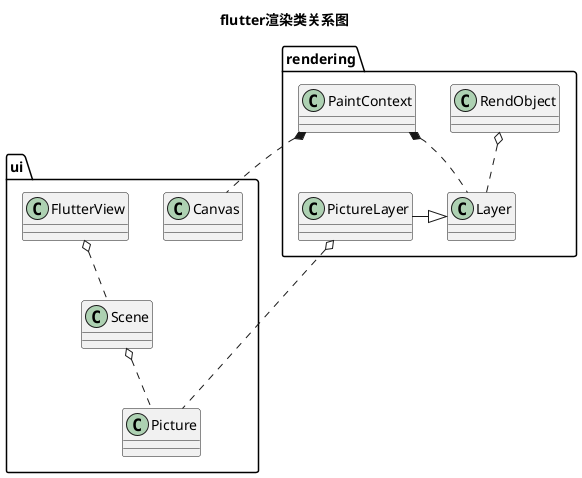

# 常用UI组件比较(iOS/Android/Flutter/QT)

本文用来比较ios/Android/flutter/qt开发过程中，常用的几种组件。包括UI的布局和渲染，多线程的支持，事件的分发，内存管理等。

因为iOS/Android/flutter/qt 都是涉及UI处理的组件，它们基本都涉及这些部分。当然，对于iOS/Android来说，他们是系统的native开发，包含更广泛的组件。而flutter/qt，更多聚焦在跨平台的UI处理。

## UI 布局和渲染

只要是UI库，都涉及UI的布局和渲染。对于native开发来说，渲染过程和系统有紧密的关系。而跨平台的第三方组件，他们或使用自己的渲染组件，或封装了native的渲染api。

本部分对其分别描述和比较。

### iOS

iOS本身native的开发方式，来描述iOS本身的布局过程和渲染过程。

#### 布局过程

iOS的布局有多种方式，包括以frame设置，以autoresizing, 以autolayout。

目前采用autolayout和frame设置，是比较流行的方式。个人觉得，在某些场景下，使用autoresizing，代码会更简洁，更便捷。

这三种方式均可以按照开发人员的需要，混合开发。不过必须理解的是，autolayout一旦使用，frame设置将在layout计算时无效。

iOS的布局回调比较简单，当parent view frame发生变化时，会调用 `layoutSubviews`. 所以当这个回调被调用时，当前frame可能会0.

##### 触发布局的方法

- `setNeedsLayout`
- `layoutIfNeeded`

这两个方法的区别是:
> `setNeedsLayout` 会在下一个消息循环中检查并执行。

```text
Invalidates the current layout of the receiver and triggers a layout update during the next update cycle.
```

> `layoutIfNeeded` 会马上检查是否需要重新布局.

```text
Updates the layout of views in the window based on the current views and constraints.

Before displaying a window that uses constraints-based layout the system invokes this method to ensure that the layout of all views is up to date. This method updates the layout if needed, first invoking updateConstraintsIfNeeded to ensure that all constraints are up to date. This method is called automatically by the system, but may be invoked manually if you need to examine the most up to date layout.
```

#### 渲染过程

iOS的渲染回调也同样比较简单，唯一调用的方法是 `drawRect`.

> `func draw(_ rect: CGRect)`

```text
The default implementation of this method does nothing. Subclasses that use technologies such as Core Graphics and UIKit to draw their view’s content should override this method and implement their drawing code there. You do not need to override this method if your view sets its content in other ways. For example, you do not need to override this method if your view just displays a background color or if your view sets its content directly using the underlying layer object.
```

##### 触发渲染的方法

iOS中触发view刷新的方法有两种：

> `func setNeedsDisplay()`
该方法会在下一个绘制循环中，执行view的刷新操作.

```text
You can use this method or the setNeedsDisplay(_:) to notify the system that your view’s contents need to be redrawn. This method makes a note of the request and returns immediately. The view is not actually redrawn until the next drawing cycle, at which point all invalidated views are updated.
```

> `func setNeedsDisplay(_ rect: CGRect)`

### Android

#### 布局过程

Android的布局和iOS比起来比较复杂。其主要包括两个过程: `onMeasure` 和 `onLayout`.

- `onMeasure`, 确定view的大小.
- `onLayout`, 确定view的位置。

```plantuml
|ViewRootImpl|
start
:performTraversals;
split
:performMeasure;
|ViewGroup|
:measureChildren;
|View|
:measure;
split again
|ViewRootImpl|
:performLayout;
|ViewGroup|
:layout;
:setFrame;
|View|
split again
|ViewRootImpl|
:performDraw;
|ViewGroup|
:onDraw;
|View|
end split

|ViewRootImpl|
end
```

##### Measure

Android的measure过程，大致可以认为是parent view设置 measure spec，children view 响应并设置自身measure的过程。



> void onMeasure (int widthMeasureSpec, 
                int heightMeasureSpec)

这里最重要的一个回调函数 `onMeasure`. `onMeasure` 过程就是根据measure spec，设置本view的大小的过程。
根据API文档，这个函数必须调用`setMeasuredDimension`设置 measured dimension。这也是这个函数的目的。

```text
CONTRACT: When overriding this method, you must call setMeasuredDimension(int, int) to store the measured width and height of this view. 
```

measure spec 是一个32位整形， 前2位表示spec(用`View.MeasureSpec.getMode`获取)，后30位为建议的大小(`View.MeasureSpec.getSize`)。

##### Layout

layout基本就是使用measure过程的大小，布局各个child view。



### 渲染过程



### Flutter

Flutter的布局和渲染是有renderObject主导的。element在flutter中，只起到一个建立render tree和标志widget位置的作用。

#### 布局过程

Flutter 布局过程坚持一个原则：children负责计算自己的大小，parent负责children的位置。每一个children的位置信息存放在parentData(`BoxParentData`)中，这是一个inherit widget。

对于2d控件来说， renderBox负责各个控件的layout过程。



#### 渲染过程

flutter中，renderobject负责渲染。涉及渲染的其它类包括：

- Canvas: 封装了skia的绘制操作，它在API文档中的定义是：

```text
An interface for recording graphical operations.
```

- Layer: 画布。包括绘制产物和容器类产物.
  - PictureLayer: 绘制产物，layer tree中的叶子结点。产生一个最终的 `Picture` 对象。该对象用于`Scene` 的渲染。
  - ContainerLayer: 容器layer，包含多个child layer。
- Scene: 最终向屏幕绘制的产物。`Scene objects can be displayed on the screen using the FlutterView.render method.`

##### 渲染类关系图



### QT

对于qt的布局过程和渲染过程，未知，需要dive deep。

## 多线程

|类型|UI线程|线程保活|多线程框架|
|---|---|---|---|
|iOS|主线程|Runloop|<li>Dispatch(GCD)<br><li>Queue|
|Android|主线程|Looper|<li>Handler<br><li>AsyncTask|
|Flutter|主Isolate|event loop|<li>LoadBalancer|
|QT|主线程|event loop|<li>QThreadPool<br><li>QtConcurrent|

- iOS的Runloop创建过程:
  - 使用`NSThread` 创建一个线程，在线程函数执行
  - RunLoop.current.run()

[iOS Threading Programming Guide](https://developer.apple.com/library/archive/documentation/Cocoa/Conceptual/Multithreading/Introduction/Introduction.html?language=objc#//apple_ref/doc/uid/10000057i)

- 