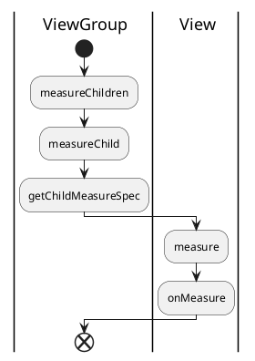
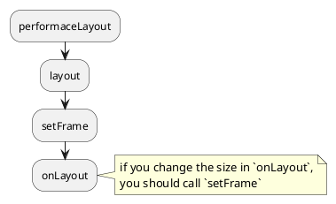
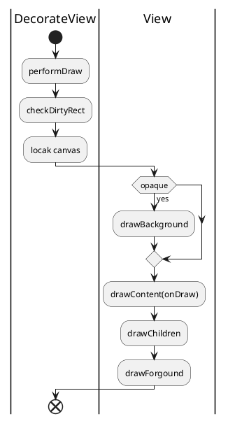
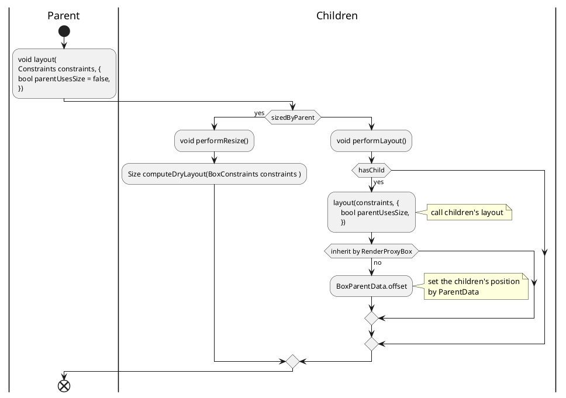
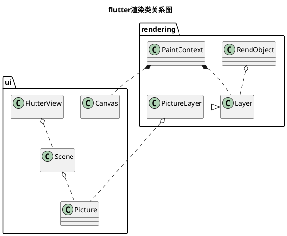
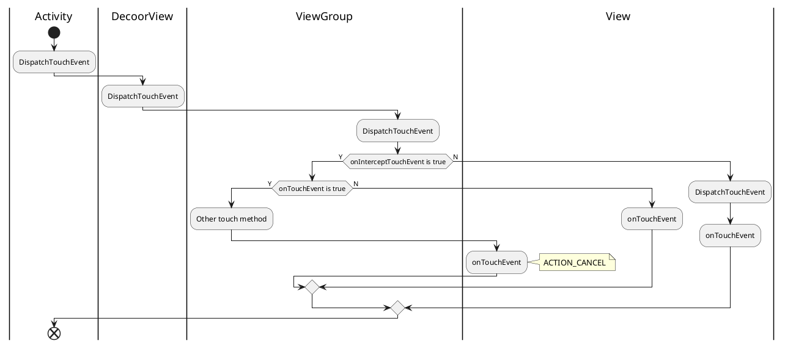

# 常用UI组件比较(iOS/Android/Flutter/QT)

本文用来比较ios/Android/flutter/qt开发过程中，常用的几种组件。包括UI的布局和渲染，多线程的支持，事件的分发，内存管理等。

因为iOS/Android/flutter/qt 都是涉及UI处理的组件，它们基本都涉及这些部分。当然，对于iOS/Android来说，他们是系统的native开发，包含更广泛的组件。而flutter/qt，更多聚焦在跨平台的UI处理。

## UI 布局和渲染

只要是UI库，都涉及UI的布局和渲染。对于native开发来说，渲染过程和系统有紧密的关系。而跨平台的第三方组件，他们或使用自己的渲染组件，或封装了native的渲染api。

本部分对其分别描述和比较。

### iOS

iOS本身native的开发方式，来描述iOS本身的布局过程和渲染过程。

#### 布局过程

iOS的布局有多种方式，包括以frame设置，以autoresizing, 以autolayout。

目前采用autolayout和frame设置，是比较流行的方式。个人觉得，在某些场景下，使用autoresizing，代码会更简洁，更便捷。

这三种方式均可以按照开发人员的需要，混合开发。不过必须理解的是，autolayout一旦使用，frame设置将在layout计算时无效。

iOS的布局回调比较简单，当parent view frame发生变化时，会调用 `layoutSubviews`. 所以当这个回调被调用时，当前frame可能会0.

##### 触发布局的方法

- `setNeedsLayout`
- `layoutIfNeeded`

这两个方法的区别是:
> `setNeedsLayout` 会在下一个消息循环中检查并执行。

```text
Invalidates the current layout of the receiver and triggers a layout update during the next update cycle.
```

> `layoutIfNeeded` 会马上检查是否需要重新布局.

```text
Updates the layout of views in the window based on the current views and constraints.

Before displaying a window that uses constraints-based layout the system invokes this method to ensure that the layout of all views is up to date. This method updates the layout if needed, first invoking updateConstraintsIfNeeded to ensure that all constraints are up to date. This method is called automatically by the system, but may be invoked manually if you need to examine the most up to date layout.
```

#### 渲染过程

iOS的渲染回调也同样比较简单，唯一调用的方法是 `drawRect`.

> `func draw(_ rect: CGRect)`

```text
The default implementation of this method does nothing. Subclasses that use technologies such as Core Graphics and UIKit to draw their view’s content should override this method and implement their drawing code there. You do not need to override this method if your view sets its content in other ways. For example, you do not need to override this method if your view just displays a background color or if your view sets its content directly using the underlying layer object.
```

##### 触发渲染的方法

iOS中触发view刷新的方法有两种：

> `func setNeedsDisplay()`
该方法会在下一个绘制循环中，执行view的刷新操作.

```text
You can use this method or the setNeedsDisplay(_:) to notify the system that your view’s contents need to be redrawn. This method makes a note of the request and returns immediately. The view is not actually redrawn until the next drawing cycle, at which point all invalidated views are updated.
```

> `func setNeedsDisplay(_ rect: CGRect)`

### Android

#### 布局过程

Android的布局和iOS比起来比较复杂。其主要包括两个过程: `onMeasure` 和 `onLayout`.

- `onMeasure`, 确定view的大小.
- `onLayout`, 确定view的位置。

```plantuml
|ViewRootImpl|
start
:performTraversals;
split
:performMeasure;
|ViewGroup|
:measureChildren;
|View|
:measure;
split again
|ViewRootImpl|
:performLayout;
|ViewGroup|
:layout;
:setFrame;
|View|
split again
|ViewRootImpl|
:performDraw;
|ViewGroup|
:onDraw;
|View|
end split

|ViewRootImpl|
end
```

##### Measure

Android的measure过程，大致可以认为是parent view设置 measure spec，children view 响应并设置自身measure的过程。



> void onMeasure (int widthMeasureSpec, 
                int heightMeasureSpec)

这里最重要的一个回调函数 `onMeasure`. `onMeasure` 过程就是根据measure spec，设置本view的大小的过程。
根据API文档，这个函数必须调用`setMeasuredDimension`设置 measured dimension。这也是这个函数的目的。

```text
CONTRACT: When overriding this method, you must call setMeasuredDimension(int, int) to store the measured width and height of this view. 
```

measure spec 是一个32位整形， 前2位表示spec(用`View.MeasureSpec.getMode`获取)，后30位为建议的大小(`View.MeasureSpec.getSize`)。

##### Layout

layout基本就是使用measure过程的大小，布局各个child view。



### 渲染过程



### Flutter

Flutter的布局和渲染是有renderObject主导的。element在flutter中，只起到一个建立render tree和标志widget位置的作用。

#### 布局过程

Flutter 布局过程坚持一个原则：children负责计算自己的大小，parent负责children的位置。每一个children的位置信息存放在parentData(`BoxParentData`)中，这是一个inherit widget。

对于2d控件来说， renderBox负责各个控件的layout过程。



#### 渲染过程

flutter中，renderobject负责渲染。涉及渲染的其它类包括：

- Canvas: 封装了skia的绘制操作，它在API文档中的定义是：

```text
An interface for recording graphical operations.
```

- Layer: 画布。包括绘制产物和容器类产物.
  - PictureLayer: 绘制产物，layer tree中的叶子结点。产生一个最终的 `Picture` 对象。该对象用于`Scene` 的渲染。
  - ContainerLayer: 容器layer，包含多个child layer。
- Scene: 最终向屏幕绘制的产物。`Scene objects can be displayed on the screen using the FlutterView.render method.`

##### 渲染类关系图



### QT

对于qt的布局过程和渲染过程，未知，需要dive deep。

## 多线程

|类型|UI线程|线程保活|多线程框架|
|---|---|---|---|
|iOS|主线程|Runloop|<li>Dispatch(GCD)<br><li>Queue|
|Android|主线程|Looper|<li>Handler<br><li>AsyncTask|
|Flutter|主Isolate|event loop|<li>LoadBalancer|
|QT|主线程|event loop|<li>QThreadPool<br><li>QtConcurrent|

- iOS的Runloop创建过程:
  - 使用`NSThread` 创建一个线程，在线程函数执行
  - RunLoop.current.run()

[iOS Threading Programming Guide](https://developer.apple.com/library/archive/documentation/Cocoa/Conceptual/Multithreading/Introduction/Introduction.html?language=objc#//apple_ref/doc/uid/10000057i)

- Android使用Looper使thread保活。它的每一个looper都有一个message queue.

通过给looper绑定一个handler，可以检索到message queue中的消息。同时，也可以通过这个handle发送指定的message运行在特定的thread上下文。

Example from API:
```java
  class LooperThread extends Thread {
      public Handler mHandler;

      public void run() {
          Looper.prepare();

          mHandler = new Handler(Looper.myLooper()) {
              public void handleMessage(Message msg) {
                  // process incoming messages here
              }
          };

          Looper.loop();
      }
  }
```

looper有很多很有帮助的方法，比如 `public void setMessageLogging (Printer printer)`, 可以打印该线程运行的时机，包括处理特定任务以及进入idle。

当Handle绑定一个looper后，就等于该线程的运行函数。可以post runnable护着message给这个handle处理。这些runnable将运行在这个线程上下文，同时，message也会派发给handle的处理回调。

- Flutter中没有线程的概念，却有 isloate的概念。每一个isloate中内存不共享。其UI运行在UI isloate中。

isloate的通信通过port进行。

```text
All Dart code runs in an isolate, and code can access classes and values only from the same isolate. Different isolates can communicate by sending values through ports (see ReceivePort, SendPort).
```

而经常使用future和async只是对isloate的切片。

- QT的UI也运行在主线程中。它的每一个对象，都有自己的运行线程。在对象被生成时，如果有parent，则会绑定parent的线程。

如果要想一个对象运行在自线程，首先这个对象没有parent，或者对象初始化在子线程上下文。

如果对象没有parent，可以通过moveToThread切换线程上下文。

这是由于qt的信号槽机制。为了使槽函数必须运行在指定的线程上，以保证线程安全而设计的。

## 事件的分发

这里的事件分发，主要包括用户点击事件，它是如何传播点击event到特定的UI控件上的。

### iOS的event(UIEvent)分发

- 通过 `hitTest` 查找响应目标。`hitTest` 返回的view将首先处理这个响应事件。

```
- (UIView *)hitTest:(CGPoint)point 
          withEvent:(UIEvent *)event;
```

- 系统将touch event等，直接传递给`hitTest` 返回的 `view`, 调用该view的`touchesBegan` 方法。

```
- (void)touchesBegan:(NSSet<UITouch *> *)touches 
           withEvent:(UIEvent *)event;

UIKit calls this method when a new touch is detected in a view or window. Many UIKit classes override this method and use it to handle the corresponding touch events. The default implementation of this method forwards the message up the responder chain. When creating your own subclasses, call super to forward any events that you do not handle yourself. For example,
```

官方API说明，通过调用`super` -> `touchesBegan`,会将事件按照response chain向上传递。

```
If you override this method without calling super (a common use pattern), you must also override the other methods for handling touch events, even if your implementations do nothing.
```

如果你override了这个方法，且没有调用super方法，则应该override其它的和touch相关的方法。

### Android的事件(MotionEvent)分发

Android的事件分发要比iOS复杂一点。因为android参与事件分发的角色比iOS的要多。

iOS中，只有uiview和UIresponse参与（其实UIview也是 UIresonse的派生类）。但Android却有 `Activity`，`DecoorView` , `ViewGroup` , `View` 参与。

Android中，事件分发包括：分发（dispatch），拦截（onInterceptTouchEvent），处理(onTouch)几个过程。



### Flutter event 分发

flutter的event有点像iOS。它也包含了一个`hitTest`的过程，这个过程不仅仅决定是否接受touch event，而且建立了一个事件响应连。

```text
bool hitTest(
BoxHitTestResult result, {
required Offset position,
})

Determines the set of render objects located at the given position.

Returns true, and adds any render objects that contain the point to the given hit test result, if this render object or one of its descendants absorbs the hit (preventing objects below this one from being hit). Returns false if the hit can continue to other objects below this one.
```

正如API文档描述那样，hitTest返回true则不会进一步传递hitTest。对于子render box来说，会把自身插入到HitTestResult的前面，也就是说会首先进行`handleEvent`.

根据文档，所有加入 `HitTestResult`,都会被调用`handleEvent`. (这里我有些疑惑，如果 A > B, B 响应事件后，A 是否需要响应事件？需要看源码进一步确认。flutter好像没有事件消费这么一个概念。iOS和Android当 touch event返回false时，认为事件没有被消费，会有进一步分发的情况。iOS会依赖next response进一步处理。Android也会由上一级的进行消费。 )

从目前的文档上来看，事件穿透，拦截等，都需要依靠 `hitTest` 来实现。

## QT 事件分发

QT的事件分为两种，一种是系统事件，比如键盘/鼠标等。另一种是信号槽。qt的事件分发比较奇怪，没有文档说明application是如何找到需要处理的widget的(我推测是focused widget)。从文档上看，application收到事件后，会交给qobject去处理。

```plantuml
|QApplication|
:Recevied Event;
if (Has filter event) then(Y)
    |Filter Object|
    if (eventFilter) then(Y)
        stop
    else(N)
    endif
endif

|Widget|
if (event) then(Y)
    stop
else (N)
    :Pop to parent;
endif

end
```

## 内存管理

|类型|垃圾回收机制|描述|
|---|---|---|
|iOS|引用计数||
|Android|垃圾回收|<li>分代标记<br><li>并发复制|
|Flutter|垃圾回收|<li>分代标记<br><li>并行清理|
|QT|引用计数||

内存管理这块，iOS和qt都是用c实现的，引用计数。
而Android/flutter等，有垃圾回收算法支持。目前大多采用的两代管理，并行复制/标记清除这样的算法。

## 总结

从上面几个比较可以看出，目前UI管理方案都具有雷同性，可以比较学习。而一些细节和依赖的编程语言，则导致实现上有一些差距。

所有的UI库需要处理都包括内存管理，线程调度。而内存管理上，c系的一般采用引用计数，其它则采用垃圾回收。对于垃圾回收来说，google系的Android/flutter甚至于go，都有相似处（对于追求细节的同学，肯定能看出他们在实现上的不同，但思想上是有共同之处）。

线程调度，基本都采用了使用looper/queue这种保活机制。而iOS、Android、qt分别有自己的线程池。

事件处理上，为了找到能够处理事件的控件，iOS/Android/flutter分别采用了不同的机制。对于Android/qt来说，分别多了一个拦截器（intercept/filter）。

内存，线程，事件分发，布局和渲染，是我们学习和掌握这些库的目标，也是我们深入了解的窗口。